# **KEYESTUDIO Mega Plus STEM Starter Kit for Arduino**

## 1.Introduction

Do you want to acquire programming knowledge? As long as you are passionate
about science and dare to explore new things, this STEM starter kit must be your
best choice.

KEYESTUDIO STEM Starter Kit is a programming learning kit based on Arduino. With
a controller, numerous sensors, modules and electronic components, you can do
many different DIY projects.

This kit also comes with 28 projects tutorials, which are entirely suitable for
beginners. Each tutorial has detailed wiring diagrams and fascinating Project
Codes. You can learn electronics, physics, science and programming knowledge.

## 2.Part List

| **** |  |  |  |                             |                                                                                                    |
|--------------------------------------------------------------|-------------------------------------------------------------------------|--------------------------------------------------------------------------|-------------------------------------------------------------------------|----------------------------------------------------------------------------|---------------------------------------------------------------------------------------------------------------------------------------------------|
| Mega Plus board\*1                                           | LED - Blue\*5                                                           | LED - Red\*5                                                             | LED - Yellow\*5                                                         | LED - Green\*5                                                             | LED - RGB\*1                                                                                                                                      |
|  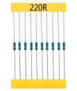            |                         |                          |                          |     |                                                                             |
| 220Ω Resistor\*10                                            | 10KΩ Resistor\*10                                                       | 1KΩ Resistor\*10                                                         | 10KΩ Potentiometer\*1                                                   | Buzzer (Active)\*1                                                         | Buzzer (Passive)\*1                                                                                                                               |
|           |                          |                           |                          |                             |                                                                                                    |
| Button Switch\*4                                             | Ball Tilt Sensor\*2                                                     | Photo Cell\*3                                                            |  Flame Sensor\*1                                                        | LM35 Temp Sensor\*1                                                        | IC 74HC595N \*1                                                                                                                                   |
|               |                          |                           |                          |    |  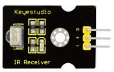                                                                                                  |
| TIP122 Transistor\*1                                         | 1 Digital Tube Display\*1                                               | 4 Digital Tube Display\*1                                                | 8\*8 LED Matrix\*1                                                      | 1602 I2C LCD \*1                                                           | IR Receiver\*1                                                                                                                                    |
|             |                          |                           |                          |                             |  |
| IR Remote Control\*1                                         | Servo Motor\*1                                                          | 130 Motor Propeller\*1                                                   | 130 Dc Motor\*1                                                         | Stepper Driver\*1                                                          | Stepper Motor\*1                                                                                                                                  |
|    |  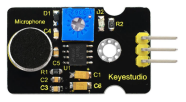                        |                           |  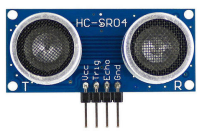                        |                             |                                                                                                    |
| Joystick Module\*1                                           | Sound Sensor\*1                                                         | PIR Motion Sensor\*1                                                     | HC-SR04 Ultrasonic\*1                                                   | DHT11 Sensor\*1                                                            | 400-hole Breadboard\*1                                                                                                                            |
|               |                          |                           |                          |                             |                                                                                                    |
| Arduino holder\*1                                            | Male to Female Dupont Wire\*10                                          | Female to Female Dupont Wire\*10                                         | Flexible jumper Wire\*20                                                | Preformed Jumper Wire\*1                                                   | 9v Battery Connector\*1                                                                                                                           |
|               |                          |                           |                          | 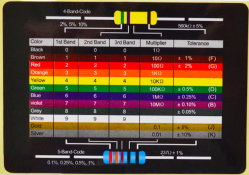                            |                                                                                                                                                   |
| Type c USB Cable\*1                                          | Cartoon paper                                                           | Cartoon paper                                                            | Cartoon paper                                                           | Resistor card                                                              |                                                                                                                                                   |

## 3.KEYESTUDIO Mega Plus Development Board

Before we get started with the KEYESTUDIO STEM Starter Kit, we first introduce
the Mega plus development board, it is the core of all the projects.

KEYESTUIDO Mega plus board, whose processor core is ATMEGA2560-16AU, is fully
compatible with ARDUINO Mega REV3.

USB to TTL chip adopts more economic and stable CP2012.

This Mega plus board consists of 54-channel digital input and output ports, of
which 15 pins are served as PWM output, 16 analog inputs, 4 serial communication
ports, one 16MHz crystal oscillator, 1 USB port, 1 power socket, 1 ICSP
interface and 1 reset button.

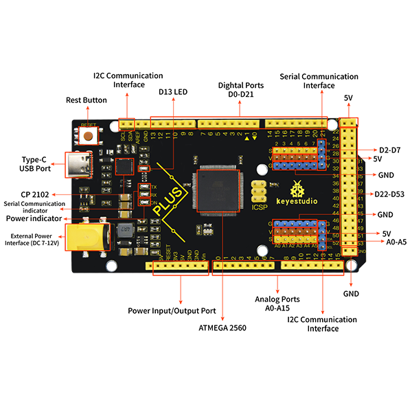

**Special Interfaces Description**

Serial communication interface(4 channel): Serial（D0 =RX0, D1 =TX0）,
Serial1（D19 is RX1, D18 is TX1)

Serial2 （D17 is RX2, D16 equals to TX2）, Serial3（D15 is RX3, D14 is TX3), D0
and D1 are connected to ATMEGA16U2-MU

PWM port（Pulse width modulation): D2-D13 and D44-D46

External interrupt pins：D2（interrupt 0), D3(interrupt 1), D21（interrupt 2),
D20 (interrupt 3), D19(interrupt 4）and D18（interrupt 5）

SPI communication interface：D53 stands for SS, D51 is MOSI, D50 is MISO, D52
equals to SCK

IIC communication interface：D20 represents SDA, D21 is SCL

## 4.Installing Driver For Windows

**4.1 Download Software**

Arduino IDE is the open-source Software makes it easy to write code and upload
it to the board. When getting the control board, we first need to install
Arduino IDE

Go to the website <https://www.arduino.cc/> and you will see the following page.

Clickand

Then you will see a page where you can download the latest version of the IDE.
There are the Installer (.exe) and the Zip packages you can choose for Windows.
We suggest you use the first one that installs directly everything you need to
use the Arduino Software (IDE), including the drivers. With the Zip package you
need to install the drivers manually. The Zip file is also useful if you want to
create a portable installation.

Pull down this page, you can also click "previous version of the current
release" to enter another page to select and install the previous version of
Arduino Software.

In this project, we choose Installer (.exe) for Windows.

Click Windows Win 7 and newer and JUST DOWNLOAD.

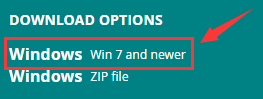

The download file: 

Double-click the arduino IDE (.exe) file

Choose "I Agree" to see the following interface.

Choose "Next" to see the following interface.

Press "Install" to initiate installation.

If the following interface appears, you should choose “Install”.

**4.2 Installing Driver on Windows**

Before using the KEYESTUDUO Mega plus control board, you must install the driver
of it, otherwise it will not communicate with computer.

Unlike the USB series chip (ATMEGA8U2) of the Arduino UNO R3, the KEYESTUDIO
Mega plus development board is used the CP2102 chip USB series chip and USB type
C interface.

The driver of the CP2102 chip is included in 1.8.0 version and newer version of
Arduino IDE. Usually, you connect the board to the computer and wait for Windows
to begin its driver installation process. After a few moments, the process will
succeed.

If the driver installation process fail, you need to install the driver
manually.

Note:

1\. Please make sure that your IDE is updated to 1.8.0 or newer version

2.If the version of Arduino IDE you download is below 1.8, you should download
the driver of CP2102 and install it manually.

Link to download the driver of CP2102:

[**https://fs.keyestudio.com/CP2102-WIN**](https://fs.keyestudio.com/CP2102-WIN)

To install the drive manually, open the device manager of computer.

Right click Computer----- Click Properties-----Click Device Manager.

Look under Ports (COM & LPT) or other device.

A yellow exclamation mark means that the CP2102 driver installation failed.

Double-click the font with yellow exclamation mark and clich “OK”

Click “browse my computer for updated driver software”.

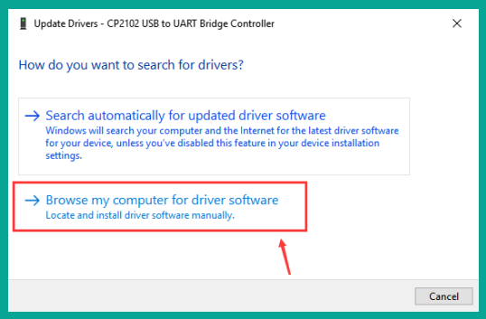

Navigate to the "Drivers" folder of the Arduino Software you have download and
click“Next”to install the drive.

The driver is installed successfully.

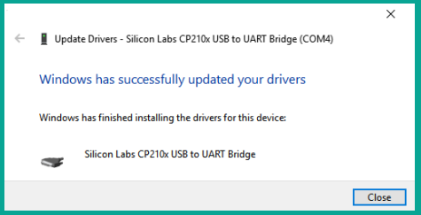

Open device manager, we will find the yellow exclamation mark disappear. The
driver of CP2102 is installed successfully.

**4.3 Configure Arduino IDE**

After the driver is successfully installed, it’s time to configure the IDE to
use the same device and port to start uploading code.

For the KEYESTUDIO Mega plus control board, we should navigate to Tools \> Board
\> and select Arduino Uno(as shown below). However, if you are using a different
board (i.e., not the Arduino Uno or KEYESTUDIO Control Board), you must select
the proper board!

Then select the correct COM port.

You can see the corresponding COM port after the driver is successfully
installed.

Navigate to Tools \> Port \>COM7

The function of each symbol in the Arduino IDE toolbar.

A- verify whether there is any compiling mistakes or not.

B- upload the sketch to your Arduino board.

C- create shortcut window of a new sketch.

D- directly open an example sketch.

E- save the sketch.

F- send the serial data received from board to the serial monitor.

**4.4 Start First Program**

Click File -\> Examples -\> 01.Basics -\>Blink

When the sketch window opens, you can see the entire sketch in the window.

Choose the correct board type and COM port

Clickto upload the code.

Dode uploarding!

The onboard LED lights on for 1s, lights off for 1s.

Congratulation, you finish the first program.

## 5.Installing Driver on MAC

**5.1 Download Software**

Click and download Arduino IDE for MAC system :

**5.2 Download the Driver of CP2102**

<https://fs.keyestudio.com/CP2102-MAC>

**5.3 How to Install the Driver of CP2102**

Connect the Mega plus development board to your computer, and open Arduino IDE

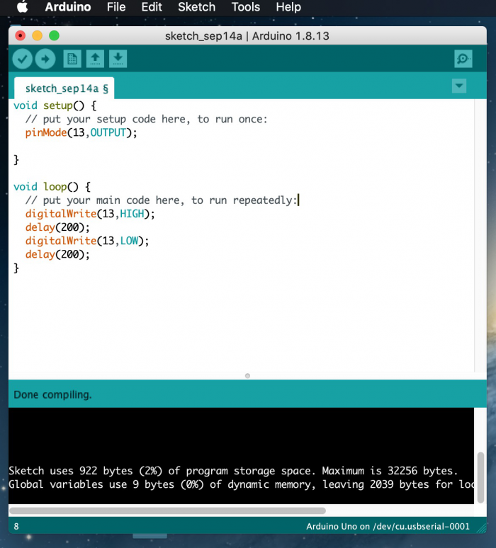

Click Tools to configure Board and Port: Arduino Uno and /dev/cu.usbserial-0001

Tap Upload to upload code, if burn successfully, you will view done uploading.

**Note: If burn unsuccessfully, you need to install driver of CP2102, please
continue to follow the instructions as below:**

**Download the driver of CP2102:**

[**https://www.silabs.com/products/development-tools/software/usb-to-uart-bridge-vcp-drivers**](https://www.silabs.com/products/development-tools/software/usb-to-uart-bridge-vcp-drivers)

1.Select Mac OSX edition

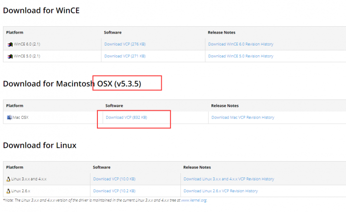

2.Unzip the downloaded package

3.Open folder and double-click SiLabsUSBDriverDisk.dmg file.

4.You will view the following files as follows:

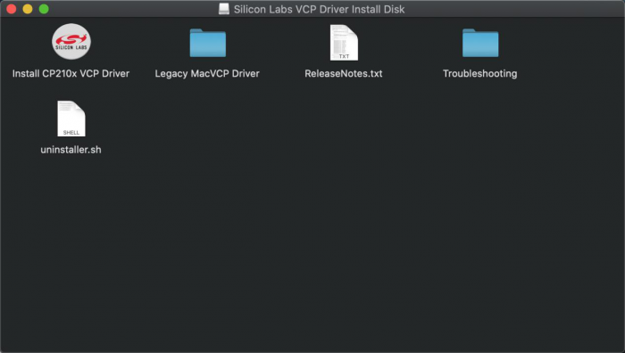

5. Double-click Install CP210x VCP Driver, tick Don’t warn me and tap Open

6. Tap Continue

7. Tap Continue and Agree

8.Click Continue and input your password

9.Select Open Security Preferences

10.Click the lock to unlock security & privacy preference.

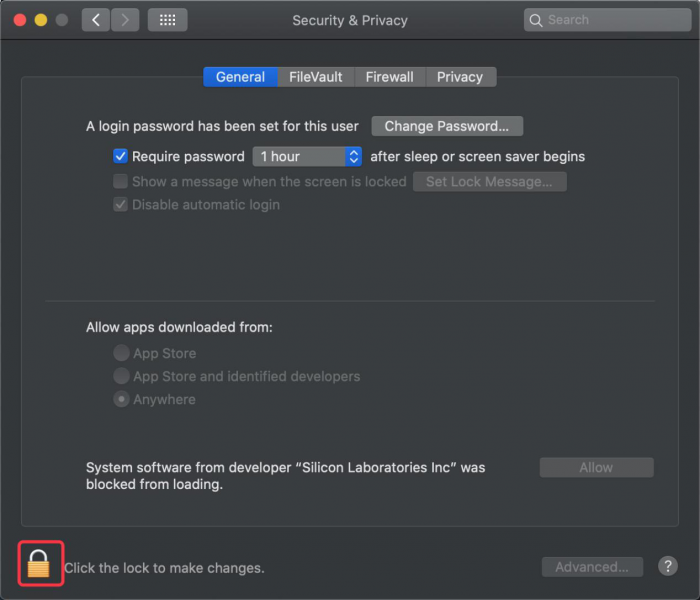

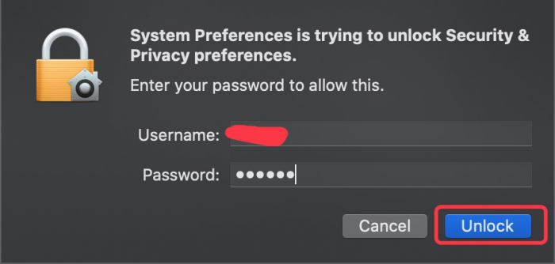

11.Then click Allow

12.Back to installation page, and wait to install.

13.Successfully installed

14.Then enter ArduinoIDE, click Tools and select Board: Arduino Uno and
/dev/cu.SLAB_USBtoUAPT

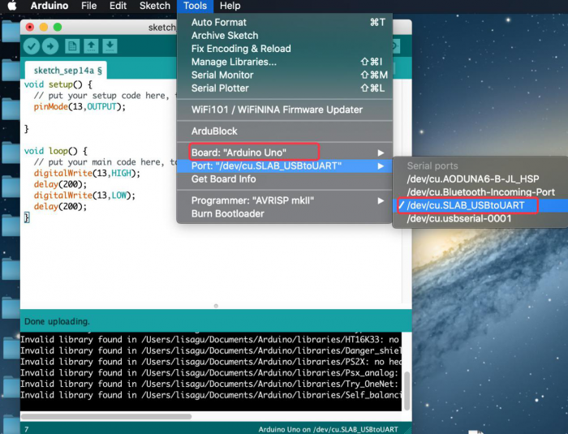

15.Click to upload code
and you will see “Done uploading”.

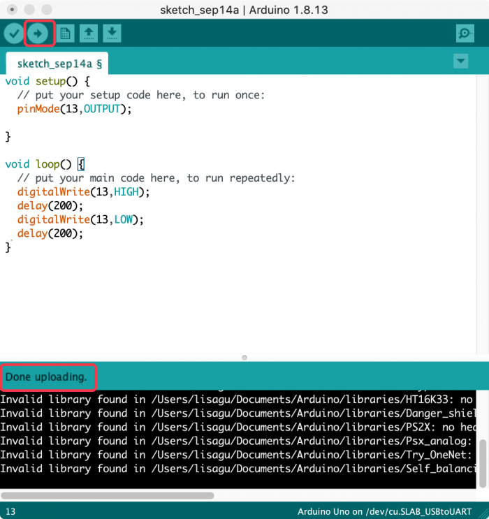

## 6.Install the Libraries to Arduino

What are Libraries ?

[Libraries](https://www.arduino.cc/en/Reference/Libraries) are a collection of
code that makes it easy for you to connect to a sensor,display, module, etc.

For example, the built-in LiquidCrystal library helps talk to LCD displays.
There are hundreds of additional libraries available on the Internet for
download.

The built-in libraries and some of these additional libraries are listed in the
reference（https://www.arduino.cc/en/Reference/Libraries）.

How to Install a Library

**6.1 Manual installation**

When you want to add a library manually, first quit the Arduino application,
then you need to download library as a ZIP file, expand it and put in the proper
directory.

For this example, we will install the IR Remote Library which can be found on
GitHub: <https://github.com/shirriff/Arduino-IRremote>

First, download the library as a ZIP, which is done by clicking the green “Code”
button and then clicking“Download ZIP”.

Once downloaded, Unzip the the IR Remote Library package.

Then go to your Arduino folder.

Open the“Libraries”folder in the Arduino folder and then drag the
“Arduino-IRremote-master”folder into the libraries folder.

The library file is manually installed.

**6.2 Using the Library Manager**

To install a new library into your Arduino IDE you can use the Library Manager
(available from IDE version 1.6.2). Open the IDE and click to the "Sketch" menu
and then Include Library \> Manage Libraries.

Then the Library Manager will open and you will find a list of libraries that
are already installed or ready for installation. In this example we will install
the Bridge library. Scroll the list to find it, click on it, then select the
version of the library you want to install. Sometimes only one version of the
library is available. If the version selection menu does not appear, don't
worry: it is normal.

Finally click on install and wait for the IDE to install the new library.
Downloading may take time depending on your connection speed. Once it has
finished, an Installed tag should appear next to the Bridge library. You can
close the library manager.

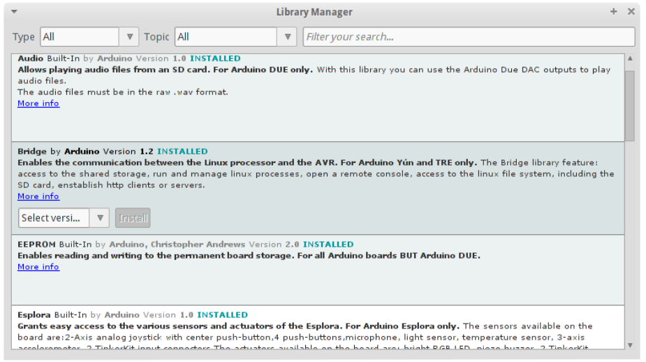

You can now find the new library available in the Sketch \> Include Library
menu.

**6.3 Importing a .zip Library**

Open the Arduino IDE, navigate to Sketch \> Include Library. At the top of the
drop down list, select the option to "Add .ZIP Library''.

We will install the IR Remote Library which can be found on GitHub:
<https://github.com/shirriff/Arduino-IRremote>

First, download the library as a ZIP, which is done by clicking the green “Code”
button and then clicking “Download ZIP”.

Navigate to the .zip file's location and open it.

Return to the Sketch \> Import Library menu.

You should now see the library at the bottom of the drop-down menu.

## 7.Project

### Project 1: Hello World

**1.Project Introduction**

For Arduino starters, we will begin with something simple. In this project, you
will only need a Mega plus development board and a USB cable to complete the
"Hello World!" project. It is not only a communication test of your Arduino
board and the PC, but also a primer project in the Arduino world!

**2.Project Hardware**

| **** |  | 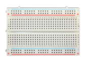 |  |  |
|--------------------------------------------------------------|-------------------------------------------------|-------------------------------------------------|-------------------------------------------------|-------------------------------------------------|
| Mega plus Development Board\*1                               | Board Holder                                    | 400-Hole Breadboard                             | USB Cable\*1                                    | Hello World Card\*1                             |

1.  **Assembly Project Platform**

Before starting the project, we will install the Mega plus development board and
400-Hole breadboard onto the board holder.

1.  Remove the adhesive sticker of the breadboard.

1.  Attach the breadboard to the board holder

1.  Use three plastic columns to fix the Mega plus development board on the
    board holder.

The assembly of the project platform is complete.

**4.Project Code**

A simple **If () statement** programming control structure will be used. Arduino
uses a serial monitor for displaying information such as print statements,
sensor data, and so on. This is a very powerful tool for debugging long codes.
Now for your first code!

<iframe src=https://create.arduino.cc/editor/keyestudio/7504cf80-7eb1-41ca-80c6-3a7d86506345/preview?embed style="height:510px;width:100%;margin:10px 0" frameborder=0></iframe>

**5.Project Result**

Double-click icon to enter serial
monitor.

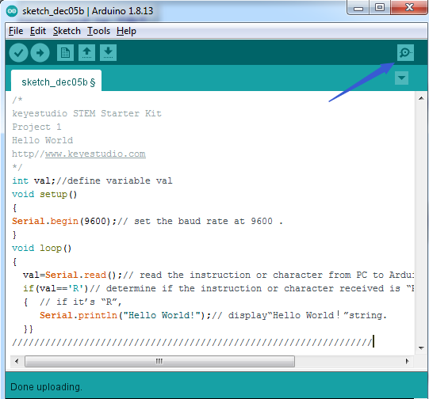

Every time you enter an "R" in the text box and click “send”, the onboard LED on
the Mega plus board will flash once, and the serial monitor will display a Hello
World!

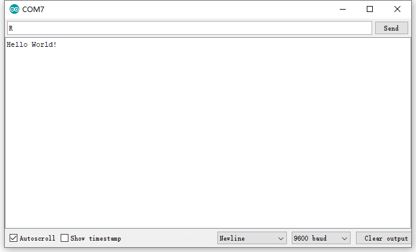

### Project 2: Blinking Eyes of Dinosaur

****

1.  **Project Introduction**

In this project, we will show you a dinosaur with a blinking eye.

We use the digital pin of Arduino to turn on an LED and let it blink, match with
a cartoon dinosaur card we provided, the LDE will become the dinosaur's
twinkling eye.

1.  **Project Hardware**

| **** |  | 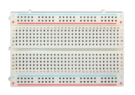 |  |
|--------------------------------------------------------------|-------------------------------------------------|-------------------------------------------------|-------------------------------------------------|
| Mega Plus Board\*1                                           | Plus Board holder                               | 400-hole Breadboard                             | USB cable\*1                                    |
|               |  |  |  |
| Red M5 LED\*1                                                | 220Ω Resistor\*1                                | Jumper Wire\*2                                  | Cartoon dinosaur Card\*1                        |

**Introduction Of Electronic Components**

**1.LED**:

LED is a type of semiconductor called "Light Emitting Diode" which is an
electronic device made of semiconductor materials (silicon, selenium, germanium,
etc). It has positive and negative poles. The short leg is the negative pole to
connect GND, and the long one is the positive pole to connect 5V.

**2.** **Five Band Resistor**

A resistor is an electronic component in the circuit, which limits and regulates
the current flow. Its unit is (Ω).

\-Band 1 – First significant digit.

\-Band 2 – Second significant digit.

\-Band 3 – Third significant digit.

\-Band 4 – Multiplier.

\-Band 5 – Tolerance.

In this kit, we provide three five-band resistors with different resistance
values.

1.  220Ω Resistor\*10

1.  10KΩ Resistor\*10

1.  1KΩ Resistor\*10

**3.** **Breadboard:**

The breadboard is used to build and test circuits quickly before finalizing any
circuit design. The breadboard has many holes which circuit components like ICs
and resistors can be inserted into.

A typical breadboard is shown below:

The bread board has strips of metal which run underneath the board and connect
the holes on the top of the board.

The metal strips are laid out as shown below. Note that the top and bottom rows
of holes are connected horizontally while the remaining holes are connected
vertically.

The first two rows (top) and last two rows (bottom) of the breadboard are used
for positive and for negative.

The conductive layout diagram of the breadboard is shown in the figure above.

The electronics beginners may get confused while connecting the DIP (Dual
In-line Packages) components such as integrated circuits, microcontrollers,
chips, etc.,. The rails are isolated by ravine or crevasse, thus the rows are
not connected to each other on either side. So, the DIP components can be
connected as shown in the figure below.

**3.Circuit Connection**

Look at the circuit schematic and wiring diagram of the project. Here we use
digital pin 10 and connect an LED to a 220 ohm resistor to avoid high current
damaging the LED. 

**circuit schematic**

**wiring diagram**

**NOTE:**

How to connect an LED

How to identify 5 band 220Ω Resistor

**4.Project Code**

<iframe src=https://create.arduino.cc/editor/keyestudio/f92f87d8-5ddf-4175-bd5f-528c49e00a23/preview?embed style="height:510px;width:100%;margin:10px 0" frameborder=0></iframe>

1.Open up the Arduino IDE and copy the below code into a new sketch.

2.Select the correct Board type and COM port for the Arduino IDE.

3.Click Upload button on Arduino IDE to upload code.

**5.Project Result**

Done uploading. The LED light connected to the D10 pin of the development board
turns on and off every second.

Put the dinosaur card on the LED bulb like the picture below, and you will get a
cute little dinosaur that can continue to blink its eye.

### Project 3: Little Star

****

**1.Project Introduction**

In this project, we will learn the PWM control of ARDUINO. PWM is the
abbreviation of Pulse Width Modulation, which is a technology that encodes
analog signal level into digital signal level.

Here, we use PWM to control the brightness of an LED from bright to dark
gradually. Match our customized star card, you will get a flickering star.

**2.Project Hardware**

| **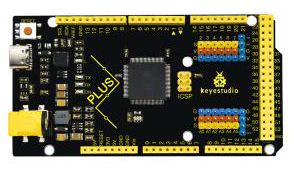** |  |   |  |
|--------------------------------------------------------------|-------------------------------------------------|--------------------------------------------------|-------------------------------------------------|
| Mega Plus Board\*1                                           |  Plus Board holder                              | 400-hole Breadboard                              | USB cable\*1                                    |
|               |  |   |  |
| M5 Red LED\*1                                                |  220Ω Resistor\*1                               | Jumper Wire\*2                                   | Cartoon Little Star Card\*1                     |

**3.PWM Working Principle**

PWM stands for Pulse Width Modulation and it is a technique to control LED’s
brightness, speed of DC motor and servo motor.

The Arduino digital pins either produces 5V (when turned HIGH) or 0V (when
turned LOW). Yet, it output a square wave signal. So if we want to dim a LED, we
cannot get the voltage between 0 and 5V from the digital pin but we can change
the ON and OFF time of the signal. If we will change the ON and OFF time fast
enough then the brightness of the led will be changed.

Before going further, let’s discuss some terms associated with PWM.

TON (On Time): It is the time when the signal is high.

TOFF (Off Time): It is the time when the signal is low.

Period: It is the sum of on time and off time.

Duty Cycle: It is the percentage of time when the signal is high during the time
of period.

So at 50% duty cycle and 1Hz frequency, the led will be high for half a second
and will be low for the other half second. If we increase the frequency to 50Hz
(50 times ON and OFF per second), then the led will be seen glowing at half
brightness by the human eye.

**Arduino and PWM**

The Arduino IDE has a built in function “analogWrite()” which can be used to
generate a PWM signal. The frequency of this generated signal for most pins will
be about 490Hz and we can give the value from 0-255 using this function.

analogWrite(0) means a signal of 0% duty cycle.

analogWrite(127) means a signal of 50% duty cycle.

analogWrite(255) means a signal of 100% duty cycle.

On KEYESTUDIO Mega Plus board, the PWM pins are 3, 5, 6, 9, 10 and 11.

The PWM pins are labeled with \~ sign.

In this project, you are going to learn how to get the PWM output from the
digital pins of Mega Plus board and control brightness of LED through code.

**4.Circuit Connection**

****

How to connect an LED

How to identify 5 band 220Ω Resistor

**5.Project Code**

<iframe src=https://create.arduino.cc/editor/keyestudio/88e4d6b7-02d3-423b-959d-7f1c7a6b4bee/preview?embed style="height:510px;width:100%;margin:10px 0" frameborder=0></iframe>

1.Open up the Arduino IDE and copy the below code into a new sketch.

2.Select the correct Board type and COM port for the Arduino IDE.

3.Click Upload button on Arduino IDE to upload code.

**6.Project Result**

Done uploading. You will see the LED lights gradually light up, and then
gradually darken.

We put the card of a star on the LED, it looks like a twinkling star in the sky

### Project 4: Traffic Light

**1.Project Introduction**

Traffic lights are prevalent in our ordinary life. According to a certain time
rule, lights operate traffic lights with three colors of red, yellow, and green.
Everyone shall abide by traffic regulations, which can avoid many traffic
accidents.

In this project, we will use a Mega plus development board, a traffic light
card, and some LEDs(red, yellow, and green) to simulate a traffic light.

**2.Project Hardware**

| **** |    |  |   |  |
|--------------------------------------------------------------|---------------------------------------------------|-------------------------------------------------|--------------------------------------------------|-------------------------------------------------|
| Mega Plus Board\*1                                           | Plus Board Holder                                 | 400-Hole Breadboard                             |  USB Cable\*1                                    | Yellow M5 LED\*1                                |
|               | 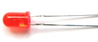   |  |   |  |
| Green M5 LED\*1                                              | Red M5 LED\*1                                     | 220Ω Resistor\*3                                | Preformed Jumper Wire\*3 Flexible jumper Wire\*4 | Traffic Light\*1                                |

**3.Circuit Connection**

****

**NOTE:**

How to connect an LED

How to identify 5 band 220Ω Resistor

**4.Project Code**

Since it is a simulation of traffic lights, the blinking time of each LED should
be the same as those in traffic lights system.

In this program, we use Arduino **delay ()** function to control delay time,
which is much simpler than C language.

<iframe src=https://create.arduino.cc/editor/keyestudio/bf454fe4-3f7e-498e-b03e-2fecc12f8f80/preview?embed style="height:510px;width:100%;margin:10px 0" frameborder=0></iframe>

1.Open up the Arduino IDE and copy the above code into a new sketch.

2.Select the correct Board type and COM port for the Arduino IDE.

3.Click Upload button on Arduino IDE to upload code.

**5.Project Result**

Done uploading. Put the traffic light card on top of the three LEDs, and you
have successfully made a traffic light.

1.  First, the green light will be on for 5 seconds, and then off.

2.  Second, the yellow light will blink for 3 times, and then off.

3.  Third, the red light will be on for 5 seconds, and then off.

4.Continue to run the above 1-3 steps until you cut off the power to the Mega
plus development board.

### Project 5: RGB LED

**1.Project Introduction**

The RGB led, consisting of three colors（red, green and blue), can emit
different colors by mixing this 3 basic colors.

In this project, we will introduce you RGB LED and show you how to use the Mega
plus development board.

We also provide a RGB color card for you to understand it easier. Even though
the RGB LED are extremely basic, it’s a great way to introduce yourself or
others to the basics of electronics and coding.

**2.Project Hardware**

| **** |  |    |  |
|--------------------------------------------------------------|-------------------------------------------------|---------------------------------------------------|-------------------------------------------------|
| Mega Plus Development Board\*1                               | Plus Board Holder                               | 400-Hole Breadboard                               | USB Cable\*1                                    |
|               |  |    |  |
| RGB LED \* 1                                                 |  220Ω Resistor\*3                               | Preformed Jumper Wire\*2 Flexible jumper Wire\*4  | RGB color Card\*1                               |

**3. Little Knowledge**

The monitors mostly comply with the RGB color standard, and all the colors on
the computer screen are composed of the three colors of red, green and blue
mixed in different proportions.

This RGB LED has 4 pins, one for each color (Red, Green, Blue) and a common
cathode. To change brightness of RGB led, we can use the PWM pins of Arduino.
The PWM pins will give signal with different duty cycles to the RGB led to
obtain different colors.

**4.Circuit Connection**

**NOTE：**

The longest pin (common cathode) of RGB LED is connected to GND.

How to identify 5 band 220Ω Resistor

**5.Project Code**

<iframe src=https://create.arduino.cc/editor/keyestudio/71b5fc22-6865-4df0-a335-1e2169803207/preview?embed style="height:510px;width:100%;margin:10px 0" frameborder=0></iframe>

1.Open up the Arduino IDE and copy the above code into a new sketch.

2.Select the correct Board type and COM port for the Arduino IDE.

3.Click Upload button to upload the code.

**6.Project Result**

Done uploading! Wait for a few seconds, you can see a colorful LED. You can also
put the RGB card we provide on top of it.

### Project 6: Battery Billboard

**1.Project Introduction**

We can see many billboards composed of different colour LEDs in daily life. They
are constantly changing their light to attract customers' attention.

In this project, we will use 5 LEDs and a battery paper card to make an
advertising panel about the battery. The sparkling light string makes it easy
for customers to notice your battery if you are a battery salesperson.

1.  **Project Hardware**

| **** |  |   |  |
|--------------------------------------------------------------|-------------------------------------------------|--------------------------------------------------|-------------------------------------------------|
| Mega Plus Development Board\*1                               |  Plus Board Holder                              | 400-Hole Breadboard                              | USB Cable\*1                                    |
|               |  |   |  |
| Red M5 LED\*5                                                | 220Ω Resistor\*5                                | Preformed Jumper Wire\*5 Flexible jumper Wire\*6 | battery billboard Card\*1                       |

**3.Circuit Connection**

**NOTE:**

How to connect an LED

How to identify 5 band 220Ω Resistor

**4.Project Code**

<iframe src=https://create.arduino.cc/editor/keyestudio/9657ddf4-dd99-4829-a58f-f29856404f4e/preview?embed style="height:510px;width:100%;margin:10px 0" frameborder=0></iframe>

1.Open up the Arduino IDE and copy the above code into a new sketch.

2.Select the correct Board type and COM port for the Arduino IDE.

3.Click Upload button to upload the code.

**5.Project Result**

Done uploading！The 5 LEDs connected to the D2-D6 pins of the development board
will gradually light up and then gradually turn off, just like a battery being
charged.

### Project 7: Little Bee

**1.Project Introduction**

The active buzzer is a sounding component. it is widely used as a sound-making
element on the computer, printer, alarm, electronic toy, telephone, timer and
more. It has an inner vibration source. Simply connect it with 5V power supply,
it can buzz continuously.

In this project, we will use an active buzzer and a cartoon bee card to make a
cute bee that can tweet.

**2.Project Hardware**

| ****            |   |  |  |
|-------------------------------------------------------------------------|--------------------------------------------------|-------------------------------------------------|-------------------------------------------------|
| Mega Plus Development Board\*1                                          |  Plus Board Holder                               | 400-Hole Breadboard                             | USB Cable\*1                                    |
|  |   |  |                                                 |
| Active buzzer\*1                                                        | Jumper Wire\*2                                   | Cartoon Small Bee Card\*1                       |                                                 |

**3. Little Knowledge**

The active buzzer inside has a simple oscillator circuit which can convert
constant direct current into a certain frequency pulse signal. Once active
buzzer receives a high level, it will produce an audible beep.

Passive buzzer is an integrated electronic buzzer without vibration source
inside. It must be driven by 2K-5K square wave instead of direct current
signals.

The appearance of the two buzzers is very similar, but the one with a green
circuit board is a passive buzzer, while the other enclosed with a black tape is
an active one. Passive buzzers don't differentiate positive while active
polarity active buzzers do.

As shown below:

**4.Circuit Connection**

****

NOTE：Note: The positive pole of the active buzzer is connected to pin 8
("+"/long pin), and the negative pole is connected to GND

**5.Project Code**

<iframe src=https://create.arduino.cc/editor/keyestudio/90cf10a0-82ff-4aa5-8135-8189baba8fe4/preview?embed style="height:510px;width:100%;margin:10px 0" frameborder=0></iframe>

1.Open up the Arduino IDE and copy the above code into a new sketch.

2.Select the correct Board type and COM port for the Arduino IDE.

3.Click Upload button to upload the code.

**6.Project Result**

Done uploading！Put the cartoon paper of the little bee on it, You will get a
little bee that can tweet.

### Project 8: Bird That Can Sing

**1.Project Introduction**

In the previous project, we studied the active buzzer, which can only emit one
sound and may make you feel monotonous.

This project will learn another buzzer, passive buzzer. Unlike an active buzzer,
a passive buzzer can emit sounds of different frequencies.

In this project, you will get a bird that can sing which is made by a cartoon
bird card and the passive buzzer we provide.

**2.Project Hardware**

| ****           |    |  |  |
|------------------------------------------------------------------------|---------------------------------------------------|-------------------------------------------------|-------------------------------------------------|
| Mega Plus Development Board\*1                                         | Plus Board Holder                                 | 400-Hole Breadboard                             | USB Cable\*1                                    |
| ![H4QG0GNSDN2S4]TSS)6UP4J](media/d1ea1bb2b2749820cab389d5b85b838b.png) |    |  |                                                 |
| Passive Buzzer\*1                                                      | Jumper Wire\*2                                    | Cartoon Small Bird Card\*1                      |                                                 |

**3. Little knowledge**

Passive buzzer is an integrated electronic buzzer without vibration source
inside. It must be driven by 2K-5K square wave instead of direct current
signals. The appearance of the two buzzers is very similar, but the one with a
green circuit board is a passive buzzer, while the other enclosed with a black
tape is an active one. Passive buzzers don't differentiate positive while active
polarity active buzzers do.

**4.Circuit Connection**

****

**5.Project Code**

<iframe src=https://create.arduino.cc/editor/keyestudio/294e6a13-13f9-4f5b-a052-b378a6c3c6b9/preview?embed style="height:510px;width:100%;margin:10px 0" frameborder=0></iframe>

1.Open up the Arduino IDE and copy the above code into a new sketch.

2.Select the correct Board type and COM port for the Arduino IDE.

3.Click Upload button to upload the code.

**6.Project Result**

Upload the project code to the Mega plus development board.

Put the cartoon paper of the bird on it, and can get a bird that can sing a nice
song.

### Project 9: Laser Bar

**1.Project Introduction**

In the previous project, we have learned how to light up a LED. There are only
22 IO ports on the Mega plus development board. How can we light up a large
number of LEDs? At sometime may run out of pins on your Arduino board and need
to extend it with shift registers.

You can use the 74HC595N to control 8 outputs at a time while only taking up a
few pins on your microcontroller. You can also link multiple registers together
to extend your output even more.

In this project, we will use 4 Red M5 LEDs, 3 Green M5 LEDs and the laser stick
card we provide to make an exciting laser stick model.

**2.Project Hardware**

| **** |   |  |  |
|--------------------------------------------------------------|--------------------------------------------------|-------------------------------------------------|-------------------------------------------------|
| Mega Plus Development Board\*1                               | Plus Board Holder                                | 400-Hole Breadboard                             | USB Cable\*1                                    |
|               |   |  |  |
| 74HC595 chip\*1                                              | Red M5 LED \*4                                   | Green M5 LED \*3                                | 220Ω Resistor\*7                                |
|               |   |                                                 |                                                 |
| Preformed/Flaxible Jumper Wire\*20+                          | Laser Stick Paper Card\*1                        |                                                 |                                                 |

1.  **74HC595 Chip Pins Description：**

| Pins No | Name  | Function                     |
|---------|-------|------------------------------|
| 1-7, 15 | Q0-Q7 | Parallel Output              |
| 8       | GND   | GND                          |
| 9       | MR    | Serial Output                |
| 10      |       | Master Reserve , connect 5V  |
| 11      | SH_CP | Shift Register Clock Output  |
| 12      | ST_CP | Storage Register Clock Input |
| 13      | OE    | Output Enable (active LOW)   |
| 14      | DS    | Serial data input            |
| 16      | Vcc   | 5V working voltage           |

-   VCC and GND are used to supply power for chip, the working voltage is 5V.

-   Q0\~Q7:This eight pins are output pins.

-   DS pin is serial input pin, we need to write data into this pin by bit.

-   STCP is a latch pin. The data can be copied to latch and output in parallel
    after 8-digit data of latch is all transmitted.

-   SHCP is a clock pin. The data can be written into storage register.

-   OE is an output enable pin, which is used to make sure if the data of latch
    is input into Q0-Q7 pins. When in low level, high level is not output. In
    this experiment, we directly connect to GND to keep low level output data.

-   MR is a pin to initialize the pin of storage register. Initialize the
    internal storage register when low level. In this experiment, we connect to
    VCC to keep high level.

-   Q7S pin is a serial output pin, which is specially used for chip cascade.

**4.Circuit Connection**

**NOTE：**Pay attention to the inserting direction of 74HC595N

**5.Project Code**

<iframe src=https://create.arduino.cc/editor/keyestudio/0f34a435-a766-4481-b3df-8e18b9dcb569/preview?embed style="height:510px;width:100%;margin:10px 0" frameborder=0></iframe>

1.Open up the Arduino IDE and copy the above code into a new sketch.

2.Select the correct Board type and COM port for the Arduino IDE.

3.Click Upload button to upload the code.

**6.Project Result**

Done uploading！

Put the Laser stick paper card on the LED, you can see 7 LEDs are light one by
one, Just like a laser stick full of power.

### Project 10: A Small Desktop Lamp

**1.Project Introduction**

Did you know that you can use Arduino to turn on an LED when you press a button?

In this project, we will use a cartoon lamp card, a button switch and an LED to
make a small desk lamp.

**2.Project Hardware**

| **** |   |  |  |
|--------------------------------------------------------------|--------------------------------------------------|-------------------------------------------------|-------------------------------------------------|
| Mega Plus Development Board\*1                               | Plus Board Holder                                | 400-Hole Breadboard                             | USB Cable\*1                                    |
|           |   | 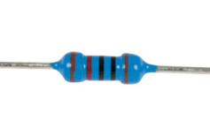 |  |
| Button switch\*1                                             | Red M5 LED \*1                                   | 10KΩ Resistor\*1                                | 220Ω Resistor\*1                                |
|               |   |                                                 |                                                 |
| Preformed&Flaxible Jumper Wire                               | Desk lamp Paper Card\*1                          |                                                 |                                                 |

**3.Little Knowledge**

The button is a component that connects two points in a circuit when you press
it.

**Schematic Diagrams:**

**4. Circuit Connection**

**NOTE:**

How to connect an LED

How to identify 5 band 220Ω Resistor and a 5 band 10KΩ Resistor

**5.Project Code**

<iframe src=https://create.arduino.cc/editor/keyestudio/b7897925-1171-4d8b-80f8-76e9dfb3b0ea/preview?embed style="height:510px;width:100%;margin:10px 0" frameborder=0></iframe>

1.Open up the Arduino IDE and copy the above code into a new sketch.

2.Select the correct Board type and COM port for the Arduino IDE.

3.Click Upload button to upload the code.

**6.Project Result**

Done uploading！Put the lamp card on the button and the LED. When the button is
pressed, LED is on, otherwise, LED remains off. In this way, the small desktop
lamp project is completed.

### Project 11: Digital Hourglass

**1.Project Introduction**

Once upon a time, people used hourglasses to measure time.

Today, we DIY a digital hourglass by using a hourglass Paper Card, a Mega Plus
Development Board, 5 Red M5 LEDs, a Ball switch.

1.  **Project Hardware**

| **** |  |  |  |
|--------------------------------------------------------------|-------------------------------------------------|-------------------------------------------------|-------------------------------------------------|
| Mega Plus Development Board\*1                               | Plus Board Holder                               | 400-Hole Breadboard                             | USB Cable\*1                                    |
|               |  |  |  |
| Ball switch\*1                                               | Red M5 LED \*5                                  | 10KΩ Resistor\*1                                | 220Ω Resistor\*5                                |
|               |  |                                                 |                                                 |
| Jumper Wire\*12                                              | hourglass Paper Card\*1                         |                                                 |                                                 |

**3.Working Principle**

The ball switch is a digital switch. There is a metal ball inside it that can
roll. The principle of the metal ball rolling and contacting the guide pin is
used to control the on or off of the circuit.

When one end of the switch is below horizontal position, the switch is on. The
voltage of the analog port is about 5V (1023 in binary). The LED will be on.

When the other end of the switch is below horizontal position, the switch is
off. The voltage of the analog port is about 0V (0 in binary). The LED will be
off.

In the program, we determine whether the switch is on or off according to the
voltage value of the analog port, whether it's above 2.5V (512 in binary) or
not.

**4.Circuit Connection**

****

**NOTE:**

How to connect an LED

How to identify 5 band 220Ω Resistor and a 5 band 10KΩ Resistor

**5.Project Code**

<iframe src=https://create.arduino.cc/editor/keyestudio/849c2a24-c624-4212-b154-3cd0a8cab7f4/preview?embed style="height:510px;width:100%;margin:10px 0" frameborder=0></iframe>

1.Open up the Arduino IDE and copy the above code into a new sketch.

2.Select the correct Board type and COM port for the Arduino IDE.

3.Click Upload button to upload the code.

**6.Project Result**

Hold the breadboard with your hands. Tilt to a certain angle, the LEDs will
light up one by one. When returning to the previous angle, the LEDs will turn
off one by one. Just like an hourglass, the sand leaked out over time.

### Project 12: A Guard Dog

****

**1.Project Introduction**

PIR sensors measure infrared (IR) light radiating from moving objects that emit
heat. The sensor allows you to detect motion of people, animals and cars to
trigger security alarms and lighting. They are used to detect movement and are
ideal for security and safety such as burglar alarms and security lighting
systems.

In this project, we will use a PIR motion sensor, a buzzer, and a cartoon dog
card to make a guard dog that sounds when someone or an animal moves nearby.

1.  **Project Hardware**

| **** |                         |  |  |
|--------------------------------------------------------------|------------------------------------------------------------------------|-------------------------------------------------|-------------------------------------------------|
| Mega Plus Development Board\*1                               | Plus Board Holder                                                      | 400-Hole Breadboard                             | USB Cable\*1                                    |
|               | ![H4QG0GNSDN2S4]TSS)6UP4J](media/d1ea1bb2b2749820cab389d5b85b838b.png) |  |  |
| PIR Motion Sensor\*1                                         | Passive Buzzer\*1                                                      | Jumper Wire\*5                                  | Guard dog Paper Card\*1                         |

**3.PIR Motion Sensor Specification**

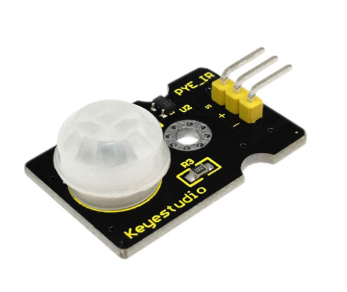

-   Input Voltage 3.3 \~ 5V (6V Maximum)

-   Working Current 15uA

-   Working Temperature -20 \~ 85 ℃

-   Output Voltage High 3V, Low 0V

-   Output Delay Time (High Level) About 2.3 to 3 Seconds

-   Detection Angle 100 °

-   Detection Distance 7 meters

-   Output Indicator LED (When output HIGH, it will be ON)

-   Pin limit Current 100mA

**4.Circuit Connection**

****

**5.Project Code**

<iframe src=https://create.arduino.cc/editor/keyestudio/64457074-2596-4913-932a-4466dd027be3/preview?embed style="height:510px;width:100%;margin:10px 0" frameborder=0></iframe>

1.Open up the Arduino IDE and copy the above code into a new sketch.

2.Select the correct Board type and COM port for the Arduino IDE.

3.Click Upload button to upload the code.

**6.Project Result**

If the PIR motion sensor detects someone moving nearby, the buzzer will sound an
alarm, and click to open the serial monitor on the Arduino IDE, you will see
"Hey I got you!!!".

### Project 13: DIY a Time Bomb

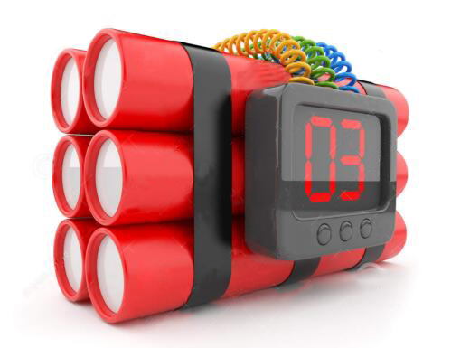

**1.Project Introduction**

A seven-segment display is a form of the electronic display device for
displaying decimal numerals, they are widely used in digital clocks, electronic
meters, basic calculators, and other electronic devices that display numerical
information. Even the bombs we saw in the movie have seven-segment displays.

Perhaps seven-segment displays don’t look modern enough for you, but they are
alternatives to the more complex dot matrix displays and are easy to use both in
limited light conditions and in strong sunlight.

In this project, we will make a simple time bomb with a 1-digit LED Segment
Display.

1.  **Project Hardware**

|  **** |    |  |  |
|---------------------------------------------------------------|---------------------------------------------------|-------------------------------------------------|-------------------------------------------------|
| Mega Plus Development Board\*1                                | Plus Board Holder                                 | 400-Hole Breadboard                             | USB Cable\*1                                    |
|                |    |  |                                                 |
| 1-digit LED Segment Display\*1                                | 220Ω Resistor\*8                                  | Jumper Wire\*10+                                |                                                 |

**3. 1-digit LED Segment Display principle**

LED segment display is a semiconductor light-emitting device. Its basic unit is
a light-emitting diode (LED).

LED segment display can be divided into the 7-segment display and 8-segment
display according to the number of segments. The 8-segment display has one more
LED unit ( for decimal point display) than 7-segment one.

Each segment of the seven segment LED display is an individual LED. According to
the wiring method of LED units, LED segment displays can be divided into common
anode displays and common cathode displays.

In a Common Cathode seven segment display. All of the cathodes (or negative
terminals) of the segment LEDs are connected together. You should connect the
common cathode to GND. To turn on a segment, you set its associated pin to HIGH

In a Common Anode seven segment display, the anodes (positive terminals) of all
of the segments are connected together. You should connect the common anode to
\+5V. To turn on a segment, you set its associated pin to LOW.

Each segment of the display consists of an LED. So when you use it, you also
need to use a current-limiting resistor. Otherwise, LED will be burnt out.

In this experiment, we use a common cathode display. As we mentioned above, you
should connect the common cathode to GND. To turn on a segment, you set its
associated pin to HIGH。

**4.Circuit Connection**

**NOTE：**

The direction of the seven-segment display inserted into the panel is consistent
with the wiring diagram, and an extra point is in the lower right corner

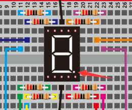

**5.Project Code**

There are seven segments for numerical display, one for decimal point display.
Corresponding segments will be turned on when displaying certain numbers.

For example, when displaying number 1, b and c segments will be turned on. We
compile a subprogram for each number, and compile the main program to display
one number every 2 seconds, cycling display number 0 \~ 9.

The displaying time for each number is subject to the delay time, the longer the
delay time, the longer the displaying time.

<iframe src=https://create.arduino.cc/editor/keyestudio/81dfdb67-b895-4fc8-b163-31f5e6b7689d/preview?embed style="height:510px;width:100%;margin:10px 0" frameborder=0></iframe>

1.Open up the Arduino IDE and copy the above code into a new sketch.

2.Select the correct Board type and COM port for the Arduino IDE.

3.Click Upload button to upload the code.

**6.Project Result**

Done uploading the code! The LED segment display will show the number from 9 to
0, at this time an interesting time bomb is complete.

### Project 14: Hand Counter

****

**1.Project Introduction**

4-digit 7-segment LED display is a very practical display device. The display of
electronic clocks, the scorer on the court, and the number of people in the park
are all needed.

Because of its low price and easy use, more and more projects will use 4-digit
7-segment LED display.

In this project, we use 4-digit 7-segment LED display to make a hand counter.

1.  **Project Hardware**

| **** |   |  |       |
|--------------------------------------------------------------|--------------------------------------------------|-------------------------------------------------|------------------------------------------------------|
| Mega Plus Development Board\*1                               | Plus Board Holder                                | 400-Hole Breadboard                             | USB Cable\*1                                         |
|               |   |  |   |
| 4-digit LED Segment Display\*1                               | 220Ω Resistor\*8                                 | Jumper Wire\*10+                                | Button Switch\*1                                     |
|               |                                                  |                                                 |                                                      |
| 10KΩ Resistor\*1                                             |                                                  |                                                 |                                                      |

**3.The Principle of 4-digit Display**

For 4-digit display, there are 12 pins in total. When you place the decimal
point downward, the pin on the lower left part is referred to as 1, the upper
left part 12.

**4.Circuit Connection**

For LED display, current-limiting resistors are indispensable. Here We use 8
Resistors of 220Ω.

1.  **Project Code**

<iframe src=https://create.arduino.cc/editor/keyestudio/61767c97-2f76-408f-a302-74326116a8e2/preview?embed style="height:510px;width:100%;margin:10px 0" frameborder=0></iframe>

**6.Project Result**

Upload the project code to the Mega plus development board. At the beginning,
the 4-digit digital tube displays 0000. Each time the button is pressed, the
number increases by 1. When the number is increased to 9999, press the button
again, and the digital tube restarts and displays 0000.

\*\*\*\*\*\*\*\*\*\*\*\*\*\*\*\*\*\*next
project\*\*\*\*\*\*\*\*\*\*\*\*\*\*\*\*\*\*\*\*\*\*\*\*\*\*\*\*\*

### Project 15: Beating Heart

**1.Project Introduction**

A dot-matrix display is an electronic digital display device that displays
information on machines, clocks and watches, public transport departure
indicators and many other devices.

In this project, we use a 8x8 LED dot matrix to make a beating heart.

**2.Project Hardware**

| **** |   |  |  |
|--------------------------------------------------------------|--------------------------------------------------|-------------------------------------------------|-------------------------------------------------|
| Mega Plus Board\*1                                           | Plus Board Holder                                | 400-Hole Breadboard                             | USB Cable\*1                                    |
|               |   |  |                                                 |
| 8\*8 Dot Matrix\*1                                           | 220Ω Resistor\*8                                 | Jumper Wire\*10+                                |                                                 |

**3. Principle of 8\*8 dot-matrix**

The external view of a dot-matrix is shown as follows

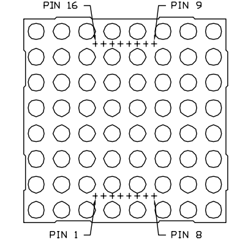

The internal view of a dot-matrix is shown as follows

The 8\*8 dot-matrix is made up of sixty-four LEDs, and each LED is placed at the
cross point of a row and a column.

When the electrical level of a certain row is 1 and the electrical level of a
certain column is 0, the corresponding LED will lighten. If you want to light
the LED on the first dot, you should set pin 9 to high level and pin 13 to low
level.

If you want to light LEDs on the first row, you should set pin 9 to high level
and pins 13, 3, 4, 10, 6, 11, 15 and 16 to low level.

If you want to light the LEDs on the first column, set pin 13 to low level and
pins 9, 14, 8, 12, 1, 7, 2 and 5 to high level.

**4.Circuit Connection**

****

**5.Project Code**

<iframe src=https://create.arduino.cc/editor/keyestudio/f3ef9a5b-c1a7-45b1-a5c9-f7b97576d392/preview?embed style="height:510px;width:100%;margin:10px 0" frameborder=0></iframe>

**6.Project Result**

Upload the project code to the Mega plus development board，the 8\*8 dot matrix
screen shows a beating heart.

### Project 16: An Expressive Frog

**1.Project Introduction**

In this project, we will make a frog that can communicate with the outside world
and express its emotions in words. Here we use an LCD 1602 display controlled by
Arduino.

The ordinary 1602 LCD display needs to occupy 7 IO ports of the control board
when working. The 1602 LCD display we provide is equipped with IIC / I2C
interface, which will save you 5 IO ports of the control board.

KEYESTUDIO 1602 I2C module is a 16 character by 2 line LCD display with Blue
background and White backlight. It is very convenient to use with Arduino Liquid
Crystal Library and great for showing letters, numbers, and characters.

On the back of LCD display there is a blue potentiometer. You can turn the
potentiometer to adjust the contrast.

(Notice that when you rotate the potentiometer the screen will get brighter or
darker, the proper angle will make the font clearer).

**2.Project Hardware**

| **** |   |  |  |
|--------------------------------------------------------------|--------------------------------------------------|-------------------------------------------------|-------------------------------------------------|
| Mega Plus Development Board\*1                               | Plus Board Holder                                | 400-Hole Breadboard                             | USB Cable\*1                                    |
|               |   |  |                                                 |
| I2C 1602 LCD\*1                                              | Jumper Wire\*4                                   | Cartoon Frog Paper Card\*1                      |                                                 |

**3.I2C 1602 LCD Parameters**

-   Display capacity 16 \* 2 characters

-   Chip operating voltage 4.5 \~ 5.5V

-   Working current 2.0mA (5.0V)

-   Optimum working voltage of the module is 5.0V

-   Character size 2.95 \* 4.35 (W \* H) mm

-   I2C Address:0x27

-   Backlight (Blue with white char color)

**4.Connection**

GND: connect to ground

VCC: connect to +5V

SDA: connect to A4

SCL: connect to A5

**5.Project Code**

<iframe src=https://create.arduino.cc/editor/keyestudio/82886ef0-2161-4b71-b54a-644c4fb14e06/preview?embed style="height:510px;width:100%;margin:10px 0" frameborder=0></iframe>

**6.Project Result**

Upload the project code to the Mega plus development board. LCD1602 will display
“Hello, world!”on the first line, “keyestudio!” on the second line.

By changing the text in the brackets of the code we provided and uploading the
code again, you can control what the frog will say through the LCD display.

lcd.print("Hello, world!");

lcd.setCursor(2,1);

lcd.print("keyestudio!");

### Project 17: Small Fan

**1.Project Introduction**

Usually, the GPIO pins of Arduino can only provide a maximum current of 40 mA.
Since even a small 5V DC motor needs 50 mA or higher current to be driven, it is
not recommended to use the Arduino GPIO pins to drive the DC motor.

In this project, we will use a Mega plus Development Board, a TIP122 triode, a
motor and small fan leaf to make an electric fan.

**2.Project Hardware**

| **** |    |  |  |
|--------------------------------------------------------------|---------------------------------------------------|-------------------------------------------------|-------------------------------------------------|
| Mega Plus Development Board\*1                               | Plus Board Holder                                 | 400-Hole Breadboard                             | USB Cable\*1                                    |
|               |    |  |  |
| TIP122 Triode\*1                                             | 1 KΩ Resistor \*1                                 | 9V Battery \*1                                  | 9V Battery holder \*1                           |
|               |    |  |                                                 |
| Fan Motor \*1                                                | Fan Leaf \*1                                      | Jumper Wire\*10+                                |                                                 |

**3.TIP122 Parameters:**

Voltage: Vceo: 100V;

Power consumption, Pd: 65W;

Collector DC current: 5A;

DC current gain hFE: 1000;

Package type: TO-220;

Number of pins: 3;

Total power, Ptot: 65W;

Number of transistors: 1;

Transistor type: Power Darlington;

Maximum continuous current, Ic: 5A;

Temperature: 25°C;

Voltage, Vcbo: 100V;

Current, Ic hFE: 3A;

Current, Ic maximum: 5A;

DC current gain hfe, minimum value: 1000;

Surface mount devices: through-hole mounting;

Collector current, average value of Ic: 5A;

Saturation voltage, Vce sat maximum: 2V

**4.Connection Diagram**

**5.Project Code**

<iframe src=https://create.arduino.cc/editor/keyestudio/0952e0d7-f274-4721-a941-65bc624b2d8c/preview?embed style="height:510px;width:100%;margin:10px 0" frameborder=0></iframe>

**6.Project Result**

Upload the project code to the Mega plus development board.

Insert the fan blade into the motor shaft, you will get a small fan that rotates
for 2 seconds, and stops for 3 seconds, then restart.

### Project 18: Car Speed Dial

**1.Project Introduction**

A servo motor is a type of motor that can rotate with great precision. It has
been widely used in many applications like toy car, RC helicopters and planes,
Robotics, etc.

In this project, we will use a servo motor and a paper card to DIY a car speed
dial.

1.  **Project Hardware**

| **** |   |  |  |
|--------------------------------------------------------------|--------------------------------------------------|-------------------------------------------------|-------------------------------------------------|
| Mega Plus Development Board\*1                               | Plus Board Holder                                | 400-Hole Breadboard                             | USB Cable\*1                                    |
|               | 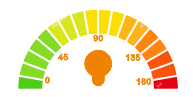  |                                                 |                                                 |
| 9G Servo Motor\*1                                            | Car Speed Dial Paper Card\*1                     |                                                 |                                                 |

**3. Working Principle of the Servo**

Servo is composed of a rudder disc, position feedback potentiometer, reduction
gear set, DC motor, and control circuit. A DC motor drives the reduction gear
set, and its output shaft drives a position feedback potentiometer with linear
proportional characteristics as position detection. According to the
potentiometer feedback voltage, the control circuit compares with the external
input control pulse, generates a correction pulse, controls and drives the DC
motor to rotate forward or reverse so that the output position of the reduction
gear is combined with the desired value. To achieve the purpose of accurately
controlling the steering angle.

The control pulse cycle of the servo is 20ms, and the pulse width ranges from
0.5ms to 2.5ms, corresponding to positions from -90 degrees to +90 degrees.

Let us take a 180-degree angle servo as an example

Servo motor comes with many specifications. But all of them have three
connection wires, distinguished by brown, red, orange (different brand may have
different color).

Brown one is for GND, red one for power positive, orange one for signal line.

**4.Connection Diagram**

**5.Project Code**

<iframe src=https://create.arduino.cc/editor/keyestudio/06d22f33-0472-41c9-b363-e906e930238b/preview?embed style="height:510px;width:100%;margin:10px 0" frameborder=0></iframe>

**6.Project Result**

Put the card of the car speed dial to the servo and insert the plastic arm of
the servo into the its rotating shaft.

Upload the project code to the Mega plus development board.

The plastic arm of the servo will move at an angle of 0 degrees, 45 degrees, 90
degrees, 135 degrees, and 180 degrees.

A car speed dial model is completed.

\*\*\*\*\*\*\*\*\*\*\*\*\*\*\*\*\*\*\*\*\*\*\*\*\*\*\*\*\*\*next
project\*\*\*\*\*\*\*\*\*\*\*\*\*\*\*\*\*\*\*\*\*\*\*\*\*\*\*\*\*\*\*\*\*\*\*\*\*

### Project 19: Clock Rotation

**1.Project Introduction**

Stepper motors can be positioned accurately and it is the most important part in
industrial robots, 3D printers, large lathes and other mechanical equipment.

In this project, we will use a stepper motor and a clock paper card to make a
clock model.

**2.Project Hardware**

| ****                                                                                      |   |  |  |
|---------------------------------------------------------------------------------------------------------------------------------------------------|--------------------------------------------------|-------------------------------------------------|-------------------------------------------------|
| Mega Plus Development Board\*1                                                                                                                    | Plus Board Holder                                | 400-Hole Breadboard                             | USB Cable\*1                                    |
|  |   |  |  |
| Stepper Motor\*1                                                                                                                                  | Stepper Motor driver\*1                          | Jumper Wire\*6                                  | Clock Paper Card\*1                             |

1.  **Stepper Motor and Driver**

Stepper Motor is a motor controlled by a series of electromagnetic coils. It can
turn an exact amount of degrees (or steps) as desired, allowing you to move it
to an exact location and hold that position. It does so by powering the coils
inside the motor for very short periods of time, but you have to power the motor
all the time to keep it in the position that you desire.

There are two basic types of stepper motors, unipolar steppers and bipolar
steppers.

In this lesson, we use a Unipolar Stepper Motor 28-BYJ48.

**Unipolar Stepper Motors**

A unipolar stepper motor has one winding with a center tap per phase. Each
section of windings is switched on for each direction of the magnetic field.
Since in this arrangement a magnetic pole can be reversed without switching the
direction of the current, the commutation circuit can be made very simple (e.g.,
a single transistor) for each winding. Typically, given a phase, the center tap
of each winding is made common: giving three leads per phase and six leads for a
typical two phase motor. Often, these two phase commons are internally joined,
so the motor has only five leads.

The simplest way of interfacing a unipolar stepper to Arduino is to use a
breakout for ULN2003A transistor array chip. The ULN2003A contains seven
darlington transistor drivers and is somewhat like having seven TIP120
transistors all in one package. The ULN2003A can pass up to 500 mA per channel
and has an internal voltage drop of about 1V when on. It also contains internal
clamp diodes to dissipate voltage spikes when driving inductive loads.To control
the stepper, apply voltage to each of the coils in a specific sequence.

Here are schematics showing how to interface a unipolar stepper motor to four
controller pins using a ULN2003A, and showing how to interface using four
TIP120’s.

**4.Circuit Connection**

****

****

**5.Project Code**

<iframe src=https://create.arduino.cc/editor/keyestudio/901b73cb-d29a-487f-aad7-f93c22264d8e/preview?embed style="height:510px;width:100%;margin:10px 0" frameborder=0></iframe>

**6.Project Result**

Upload the code to the Mega plus development board. Open the serial monitor and
set the baud rate to 9600, we input A in the serial monitor, the stepper motor
is forwarding, and input C in the serial monitor, the stepper motor is reversed.

\*\*\*\*\*\*\*\*\*\*\*\*\*\*\*\*\*\*\*\*\*\*\*\*\*\*\*\*\*next
project\*\*\*\*\*\*\*\*\*\*\*\*\*\*\*\*\*\*\*\*\*\*\*\*\*\*\*\*\*\*\*\*\*\*\*\*\*

### Project 20: Dimmable Table Lamp

**1.Project Introduction**

A potentiometer is a three-terminal resistor with a sliding or rotating contact
that forms an adjustable voltage divider. It work by varying the position of a
sliding contact across a uniform resistance. In a potentiometer, the entire
input voltage is applied across the whole length of the resistor, and the output
voltage is the voltage drop between the fixed and sliding contact.

In this project, we are going to learn how to use Arduino to read the value of
the potentiometer, and make a dimmable table lamp.

1.  **Project Hardware**

| **** |   |  |  |
|--------------------------------------------------------------|--------------------------------------------------|-------------------------------------------------|-------------------------------------------------|
| Mega Plus Development Board\*1                               | Plus Board Holder                                | 400-Hole Breadboard                             | USB Cable\*1                                    |
|               |   |  |  |
| Potentiometer \*1                                            | Red M5 LED \*1                                   | 220Ω Resistor\*1                                | Jumper Wire\*6                                  |
|               |                                                  |                                                 |                                                 |
| Table Lamp Paper Card\*1                                     |                                                  |                                                 |                                                 |

**3.Potentiometer Features**

Adjustable potentiometer is a kind of resistor and an analog electronic
component, which has two states of 0 and 1(high level and low level). The analog
quantity is different, its data state presents a linear state such as 1 to 1000.

**4.Read Potentiometer Value**

We connect the Adjustable potentiometer to the analog pin of Arduino to read its
value. Please refer to the following wiring diagram for wiring.

<iframe src=https://create.arduino.cc/editor/keyestudio/cf1d750c-718b-4d7c-b80a-63c18fe80ad8/preview?embed style="height:510px;width:100%;margin:10px 0" frameborder=0></iframe>

When you rotate the potentiometer knob, you can see the displayed value change.
The reading of analog value is a very common function since most sensors output
analog value. After calculation, you can get the corresponding value you need.

Below figure shows the analog value it reads.

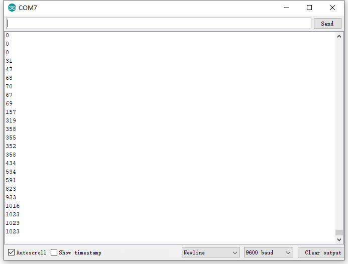

**5.Dimming Table Lamp Circuit Connection**

In the last step, we read the value of the potentiometer, and now we need to
convert the value of the potentiometer into the brightness of the LED to make a
small desk lamp with adjustable brightness. See the wiring diagram.

**6.Project Code**

<iframe src=https://create.arduino.cc/editor/keyestudio/0277c290-d10d-4aba-a711-f1bc26b195c3/preview?embed style="height:510px;width:100%;margin:10px 0" frameborder=0></iframe>

**7.Project Result**

Put the lamp paper card on the potentiometer and the led.

Upload the code to the Mega plus development board.

Open the serial monitor, set the baud rate to 9600, and the monitor will display
the value of potentiometer.

When we turn the potentiometer, the brightness of the LED will change.

A model of a small desk lamp equipped with an adjustable brightness switch is
completed.

### Project 21: Flame Alarm

**1.Project Introduction**

Fire is one of the terrible disasters, and Fire Alarm Systems are very useful in
houses, commercial building, and factories

In this project, we will use the flame sensor and buzzer to make a fire alarm
device. This is a meaningful maker activity.

**2.Project Hardware**

| **** |                            |  |  |
|--------------------------------------------------------------|---------------------------------------------------------------------------|-------------------------------------------------|-------------------------------------------------|
| Mega Plus Development Board\*1                               | Plus Board Holder                                                         | 400-Hole Breadboard                             | USB Cable\*1                                    |
|               |    |  |  |
| Flame Sensor \*1                                             | Buzzer \*1                                                                | 10KΩ Resistor\*1                                | Jumper Wire\*7                                  |
|               |                                                                           |                                                 |                                                 |
| Fire Alarm Paper Card\*1                                     |                                                                           |                                                 |                                                 |

**3.Little Knowledge**

The flame will emit some level of IR light, this light is not visible to human
eyes but our flame sensor can detect it and alert a microcontroller like Arduino
that a fire has been detected. It has an infrared receiving tube specially
designed to detect fire, and then to convert the flame brightness into
fluctuating level signal.

The shorter lead of the receiving triode is negative, the other one is positive.
We should connect negative to 5V pin, connect positive to an analog pin, a
resistor, and GND. As shown below

**4.Read Flame Sensor Value**

We first use a simple code to read the value of the flame sensor, print it in
the serial monitor.

**Project code**

<iframe src=https://create.arduino.cc/editor/keyestudio/9e42c1df-b4b0-4142-a5c1-8cb9c94543a5/preview?embed style="height:510px;width:100%;margin:10px 0" frameborder=0></iframe>

Upload the code to the Mega plus development board, open the serial monitor, and
use a lighter to approach the flame sensor to see the value.

**5.Flame Alarm Circuit Connection**

Next, we will use the flame sensor and buzzer RGB LED to make a fun project---
flame alarm. When flame is detected, the RGB will light up and the buzzer will
alarm.

**6.Project Code**

<iframe src=https://create.arduino.cc/editor/keyestudio/de7500ce-c924-42a7-ae3b-628419d3017a/preview?embed style="height:510px;width:100%;margin:10px 0" frameborder=0></iframe>

**7.Project Result**

Upload the code to the Mega plus development board.

Open the serial monitor, set the baud rate to 9600, and the monitor will display
the value of the flame sensor.

We use a lighter close to the flame sensor, the RGB LED will emit different
colors, and the buzzer will alarm.

\*\*\*\*\*\*\*\*\*\*\*\*\*\*\*\*\*\*\*\*\*\*\*\*\*\*\*\*\*\*next
project\*\*\*\*\*\*\*\*\*\*\*\*\*\*\*\*\*\*\*\*\*\*\*\*\*\*\*\*\*\*\*\*\*\*\*\*\*

### Project 22: Light Lamp

**1.Project Introduction**

A photocell is a resistor that changes resistance depending on the amount of
light incident on it. A photocell operates on semiconductor photoconductivity:
the energy of photons hitting the semiconductor frees electrons to flow,
decreasing the resistance.

We use the characteristics of Photocell to make a light-controlled table lamp.

**2.Project Hardware**

| **** |    |  |  |
|--------------------------------------------------------------|---------------------------------------------------|-------------------------------------------------|-------------------------------------------------|
| Mega Plus Development Board\*1                               | Plus Board Holder                                 | 400-Hole Breadboard                             | USB Cable\*1                                    |
|               |    |  |  |
| Photocell \*1                                                | Red M5 LED \*1                                    | 220Ω Resistor\*1                                | 10KΩ Resistor\*1                                |
|               |    |                                                 |                                                 |
| Jumper Wire\*6                                               | Light Lamp Paper Card\*1                          |                                                 |                                                 |

1.  **Photocell Little Knowledge**

Photocell is commonly applied in the measurement of light, light control and
photovoltaic conversion (convert the change of light into the change of
electricity).

Photocell is also being widely applied to various light control circuit, such as
light control and adjustment, optical switches, etc.

We will start with a relatively simple experiment regarding to photovaristor
application.

**4.Read Photocell Value**

We first use a simple code to read the value of the photocell, print it in the
serial monitor

<iframe src=https://create.arduino.cc/editor/keyestudio/dba4cc97-d900-426f-9344-ad2d22c75b06/preview?embed style="height:510px;width:100%;margin:10px 0" frameborder=0></iframe>

Upload the code to the Mega plus development board, open the serial monitor, and
then you can read the value of photocell. We put our hands on the photocell, and
you will find that the value displayed on the serial monitor becomes greater.

**5.Light Lamp Circuit Connection**

We made a small dimming table lamp, and now we are apt to make a
light-controlled table lamp. Their principles of them are same. That is getting
the analog value of the sensor through Arduino and then adjusting the brightness
of the LED.

****

**6.Project Code**

<iframe src=https://create.arduino.cc/editor/keyestudio/5bf604e1-7490-4b91-8d12-e6a311101908/preview?embed style="height:510px;width:100%;margin:10px 0" frameborder=0></iframe>

**7.Project Result**

Hook up the components as follows.

Upload the code to the Mega plus development board.

Open the serial monitor and set the baud rate to 9600. The monitor will display
the current photocell value.

When we put our hands on the photocell, the value displayed on the serial
monitor will become larger and LED will dim. When we release our finger, the
displayed value will become smaller and the LED will become brighter.

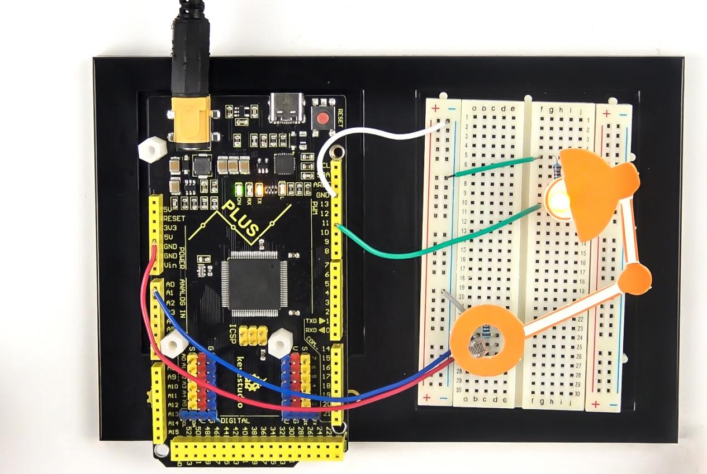

\*\*\*\*\*\*\*\*\*\*\*\*\*\*\*\*\*\*\*\*\*\*\*\*\*\*\*\*\*\*\*\*\*next
project\*\*\*\*\*\*\*\*\*\*\*\*\*\*\*\*\*\*\*\*\*\*\*\*\*\*\*\*\*\*\*\*\*\*\*\*\*

### Project 23: Smart Fan

**1.Project Introduction**

The sound sensor has a built-in capacitive electret microphone and power
amplifier. It can be used to detect the sound intensity of the environment.

In this project, we use a sound sensor and a DC motor to make a voice-activated
smart fan.

**2.Project Hardware**

| **** |   |  |  |
|--------------------------------------------------------------|--------------------------------------------------|-------------------------------------------------|-------------------------------------------------|
| Mega Plus Development Board\*1                               | Plus Board Holder                                | 400-Hole Breadboard                             | USB Cable\*1                                    |
| 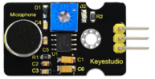              |   |  |  |
| Sound sensor \*1                                             | TIP122 Triode\*1                                 | 1 KΩ Resistor \*1                               | 9V Battery \*1                                  |
|               |   |  |  |
| 9V Battery holder \*1                                        | Fan Motor \*1                                    | Fan Leaf \*1                                    | Jumper Wire\*10+                                |
|               |                                                  |                                                 |                                                 |
| Mic Paper Card\*1                                            |                                                  |                                                 |                                                 |

**3.Sound Sensor Little Knowledge**

Sound sensor is typically used in detecting the loudness in ambient environment.
The Arduino can collect its output signal by analog input interface.

The S pin is analog output that is voltage signal real-time output of
microphone. The sensor comes with a potentiometer, so that you can adjust the
signal gain.

It also has a fixed hole to mount the sensor on any other devices. You can use
it to make some interactive works, such as a voice operated switch.

1.  **Read Sound Sensor Value**

We first use a simple code to read the value of the sound sensor, print it in
the serial monitor, and wire up.

<iframe src=https://create.arduino.cc/editor/keyestudio/6121c4af-035b-48a7-a53b-a1889493b12c/preview?embed style="height:510px;width:100%;margin:10px 0" frameborder=0></iframe>

Upload the code to the Mega plus development board, open the serial monitor,
blow or clap your hands at the sensor, you can see the sensor's value changes
significantly.

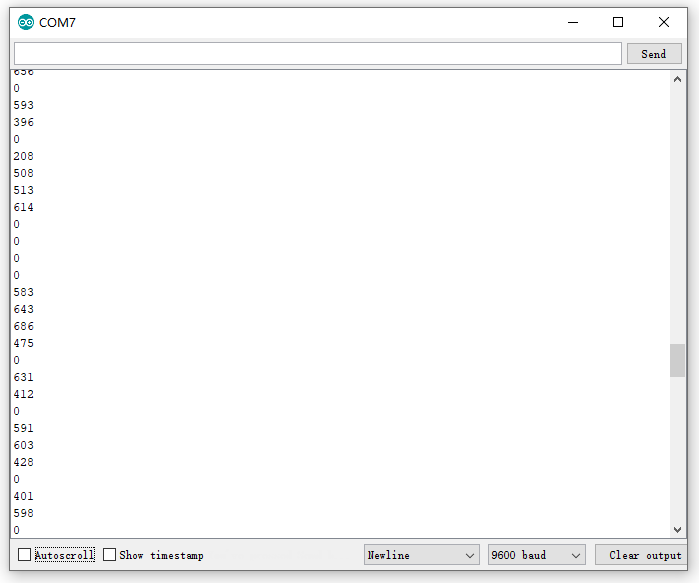

1.  **Smart Fan Connection Diagram**

Next, we formally enter this project. We use a sound sensor and a small motor to
make a sound-activated fan. Connect to the circuit diagram below.

**6.Project Code**

<iframe src=https://create.arduino.cc/editor/keyestudio/949e9db2-1366-4fe2-93fd-5575a81ff45f/preview?embed style="height:510px;width:100%;margin:10px 0" frameborder=0></iframe>

**7.Project Result**

Upload the code to the Mega plus development board. After success, open the
serial monitor, set the baud rate to 9600, and the monitor displays the value of
the sound.

We blow to the sound sensor. When the sound is louder, the value displayed on
the serial monitor is larger. When the value is greater than 700, the fan starts
to work.

\*\*\*\*\*\*\*\*\*\*\*\*\*\*\*\*\*\*\*\*\*\*\*\*\*\*\*\*\*\*\*\*next
project\*\*\*\*\*\*\*\*\*\*\*\*\*\*\*\*\*\*\*\*\*\*\*\*\*\*\*\*\*\*\*\*\*\*\*\*\*

### Project 24: Temperature Tester

**1.Project Introduction**

LM35 is a common and easy-to-use temperature sensor. It does not require other
hardware. You just need an analog port to make it work. The difficulty lies in
compiling the code to convert the analog value it reads into Celsius
temperature.

In this project, we use a temperature sensor and 3 LED lights to make a
temperature tester. When the temperature sensor touches different temperature
objects, the LED lights will show different colors.

**2.Project Hardware**

| **** |    |  |  |
|--------------------------------------------------------------|---------------------------------------------------|-------------------------------------------------|-------------------------------------------------|
| Mega Plus Development Board\*1                               | Plus Board Holder                                 | 400-Hole Breadboard                             | USB Cable\*1                                    |
| 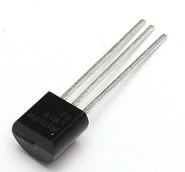              |    |  |  |
| LM35 sensor\*1                                               | Red M5 LED \*3                                    | 220Ω Resistor\*1                                | Jumper Wire\*10+                                |
|               |                                                   |                                                 |                                                 |
| Temperature tester Paper Card\*1                             |                                                   |                                                 |                                                 |

**3. Temperature Sensor Working Principle**

LM35 is a widely used temperature sensor with many different package types. At
room temperature, it can achieve the accuracy of ±1/4°C without additional
calibration processing.

LM35 temperature sensor can produce different voltage by different temperature

When temperature is 0 ℃, it outputs 0V; if increasing 1 ℃, the output voltage
will increase 10 mv.

The output temperature is 0℃～100℃, the conversion formula is as follows:

**4.Read Temperature Value**

We first use a simple code to read the value of the temperature sensor, print it
in the serial monitor, and wire it as shown below.

Here, LM35 output is given to analog pin A0 of Mega plus board. This analog
voltage is converted to its digital form and processed to get the temperature
reading.

<iframe src=https://create.arduino.cc/editor/keyestudio/d5a45772-c1d8-4564-9396-9fabe9692936/preview?embed style="height:510px;width:100%;margin:10px 0" frameborder=0></iframe>

Upload the code to the Mega plus development board, open the serial monitor, and
then you can read the current temperature value.

**5.Temperature Tester Circuit Connection**

Now use the LM35 temperature sensor and 3 LEDs to do a temperature tester. When
the temperature tester senses different temperatures, different LEDs will light
up. Follow the diagram below for wiring.

**6.Project Code**

<iframe src=https://create.arduino.cc/editor/keyestudio/02e05687-9ba4-4b25-ad93-dcea77951308/preview?embed style="height:510px;width:100%;margin:10px 0" frameborder=0></iframe>

**7.Project Result**

Upload the code to the Mega plus development board, open the serial monitor and
set the baud rate to 9600. The monitor displays the current temperature value.

We wire up components as below. When temperature sensor works, LED will light
up.

\*\*\*\*\*\*\*\*\*\*\*\*\*\*\*\*\*\*\*\*\*\*\*\*\*\*\*\*\*\*\*next
project\*\*\*\*\*\*\*\*\*\*\*\*\*\*\*\*\*\*\*\*\*\*\*\*\*\*\*\*\*\*\*\*\*\*\*\*\*

### Project 25: Batman Is Coming

****

**1.Project Introduction**

HC-SR04 Ultrasonic Sensor is a very affordable distance sensor that is mainly
used for object avoidance in various robotics projects.

It has also been used in water level sensing, and even as a parking sensor.

We use the ultrasonic sensor as the eyes of a bat. In the dark, the bat can
still recognize the object and direction in front of it through ultrasound.

**2.Project Hardware**

| **** |    |  |  |
|--------------------------------------------------------------|---------------------------------------------------|-------------------------------------------------|-------------------------------------------------|
| Mega plus Development Board\*1                               | Plus Board Holder                                 | 400-Hole Breadboard                             | USB Cable\*1                                    |
|               |    |  |  |
| Ultrasonic Sensor\*1                                         | Red M5 LED \*3                                    | 220Ω Resistor\*1                                | Jumper Wire\*4                                  |
|               |                                                   |                                                 |                                                 |
| Cartoon Bat Paper Card\*1                                    |                                                   |                                                 |                                                 |

1.  **Specification**

The HC-SR04 ultrasonic sensor uses sonar to determine distance to an object like
bats do. It offers excellent non-contact range detection with high accuracy and
stable readings in an easy-to-use package. It operation is not affected by
sunlight or black material like sharp rangefinders are (although acoustically
soft materials like cloth can be difficult to detect). It comes with ultrasonic
transmitter and receiver module.

On the front of the ultrasonic range finder are two metal cylinders. These are
transducers. Transducers convert mechanical forces into electrical signals. In
the ultrasonic range finder, there is a transmitting transducer and receiving
transducer. The transmitting transducer converts an electrical signal into the
ultrasonic pulse, and the receiving transducer converts the reflected ultrasonic
pulse back into an electrical signal. If you look at the back of the range
finder, you will see an IC behind the transmitting transducer labelled MAX3232.
This is the IC that controls the transmitting transducer. Behind the receiving
transducer is an IC labelled LM324. This is a quad Op-Amp that amplifies the
signal generated by the receiving transducer into a signal that’s strong enough
to transmit to the Arduino.

**TIMING DIAGRAM**

The timing diagram of HC-SR04 is shown. To start measurement, Trig of SR04 must
receive a pulse of high (5V) for at least 10us, this will initiate the sensor
will transmit out 8 cycle of ultrasonic burst at 40kHz and wait for the
reflected ultrasonic burst. When the sensor detected ultrasonic from receiver,
it will set the Echo pin to high (5V) and delay for a period (width) which
proportion to distance. To obtain the distance, measure the width (Ton) of Echo
pin.

Time = Width of Echo pulse, in us (micro second)

Distance in centimeters = Time / 58

Distance in inches = Time / 148

1.  **Read Ultrasonic Sensor Value**

We will start with a simple ultrasonic range finder that measures the output
distance to the serial monitor.

The HC-SR04 ultrasonic sensor has four pins: Vcc, Trig, Echo, and GND. The Vcc
pin supplies the power to generate the ultrasonic pulses. The GND pin is
connected to ground. The Trig pin is where the Arduino sends the signal to start
the ultrasonic pulse. The Echo pin is where the ultrasonic sensor sends the
information about the duration of the trip taken by the ultrasonic pulse to the
Mega plus development board.

Build the circuit as below diagram:

<iframe src=https://create.arduino.cc/editor/keyestudio/30987795-6e19-4a14-934e-92e75dabfd15/preview?embed style="height:510px;width:100%;margin:10px 0" frameborder=0></iframe>

After upload well the code to Mega plus board., then open the serial monitor.

When place an object in front of the ultrasonic sensor (from near and far), it
will detect the distance of object. The value will be displayed on the monitor.

**5.Circuit Connection**

Next, we will use the ultrasonic module and 4 LEDs to make a simple ultrasonic
rangefinder.Build the circuit as below digram:

**6.Project Code**

<iframe src=https://create.arduino.cc/editor/keyestudio/1758541d-6ff8-41da-902a-8d218acc9889/preview?embed style="height:510px;width:100%;margin:10px 0" frameborder=0></iframe>

**7.Project Result**

Upload the code to the Mega plus development board. Hook up components as
follows. The ultrasonic module can detect the distance of the obstacle in front.
Also, as we cover the ultrasonic module by hand, the corresponding LED will
light up.

\*\*\*\*\*\*\*\*\*\*\*\*\*\*\*\*\*\*\*\*\*\*\*\*\*\*\*\*\*\*\*next
project\*\*\*\*\*\*\*\*\*\*\*\*\*\*\*\*\*\*\*\*\*\*\*\*\*\*\*\*\*\*\*\*\*\*\*\*\*

### Project 26: Spinning Ferris Wheel

**1.Project Introduction**

Joystick is a component with two analog inputs and one digital input. It is
widely used in game operation, robot control, drone control and other fields.

In this project, we use a joystick module and stepper motor to make a rotating
ferris wheel. You can have a deeper understanding of the principle and operation
of joystick in practice.

1.  **Project Hardware**

| ****                                                                                      |    |             |  |
|---------------------------------------------------------------------------------------------------------------------------------------------------|---------------------------------------------------|------------------------------------------------------------|-------------------------------------------------|
| Mega plus Development Board\*1                                                                                                                    | Plus Board Holder                                 | 400-Hole Breadboard                                        | USB Cable\*1                                    |
|  |    |  |  |
| Stepper Motor\*1                                                                                                                                  | Stepper Motor driver\*1                           | Joystick Module\*1                                         | Jumper Wire\*10                                 |
|                                                                                                    |                                                   |                                                            |                                                 |
| Ferris Wheel Paper Card\*1                                                                                                                        |                                                   |                                                            |                                                 |

1.  **Joystick Module**

Joystick module has 5 pins: Vcc, Ground, X, Y, Key. The thumbstick provides
accurate readings. Additionally, you can press the joystick down to activate a
‘press to select’ push-button.

1.  **Read Joystick Module value**

We have to use analog Arduino pins to read the data from the X/Y pins, and a
digital pin to read the button.Please connect according to the wiring diagram
below.

<iframe src=https://create.arduino.cc/editor/keyestudio/f9c483a7-1f3f-49b0-804b-4804440d58aa/preview?embed style="height:510px;width:100%;margin:10px 0" frameborder=0></iframe>

Upload the code to Mega plus board. Then open the serial monitor and set the
baud rate to 9600. You can see its value on the serial monitor when you shake
the joystick, or press the button

1.  **Spinning ferris wheel Circuit Connection**

We have just read the value of the joystick, here we need to use the joystick
and stepper motor to do some things, connect according to the following figure.

****

**6.Project Code**

<iframe src=https://create.arduino.cc/editor/keyestudio/8fdd31eb-22a6-4d3b-a16e-36e7ac930a1f/preview?embed style="height:510px;width:100%;margin:10px 0" frameborder=0></iframe>

**7.Project Result**

Upload the project code to the Mega plus development board. Hook up the
components as follows. Push the joystick, the stepper motor will rotate, just
like we are playing on the Ferris wheel.

\*\*\*\*\*\*\*\*\*\*\*\*\*\*\*\*\*\*\*\*\*\*\*\*\*\*\*\*\*\*next
project\*\*\*\*\*\*\*\*\*\*\*\*\*\*\*\*\*\*\*\*\*\*\*\*\*\*\*\*\*\*\*\*\*\*\*\*\*

### Project 27: Temperature Humidity Meters

**1.Project Introduction**

DHT11 Temperature and Humidity Sensor features calibrated digital signal output
with the temperature and humidity sensor complex. Its technology ensures high
reliability and excellent long-term stability. A high-performance 8-bit
microcontroller is connected.

This sensor includes a resistive element and a sense of wet NTC temperature
measuring devices. It has the advantages of excellent quality, fast response,
anti-interference ability and high cost performance.

We use DHT11 Temperature and Humidity Sensor to make a temperature humidity
meters. The shape of this project is a cloud. Of course, we have to combine the
1602 screen to display the temperature and humidity values.

**2.Project Hardware**

| **** |   |  |  |
|--------------------------------------------------------------|--------------------------------------------------|-------------------------------------------------|-------------------------------------------------|
| Mega Plus Development Board\*1                               | Plus Board Holder                                | 400-Hole Breadboard                             | USB Cable\*1                                    |
|               |   |  |  |
| I2C 1602 LCD\*1                                              | DHT11 Sensor\*1                                  | Jumper Wire\*7                                  | Cartoon Cloud Paper Card\*1                     |

**3.DHT11 Specification**

The DHT11 humidity and temperature sensor makes it really easy to add humidity
and temperature data to your DIY electronics projects. It’s perfect for remote
weather stations, home environmental control systems, and farm or garden
monitoring systems.

-   Supply Voltage +5 V

-   Temperature Range 0-50 °C error of ± 2 °C

-   Humidity 20-90% RH ± 5% RH error

-   Interface digital

**4.Read Temperature and Humidity Value**

Firstly we learn how to use serial monitor to print the value of the DHT11
sensor. Follow the wiring diagram below.

Please download the
[DHT11Lib](https://github.com/RobTillaart/Arduino/tree/master/libraries/DHTlib)
firstly. Or [see the website](http://playground.arduino.cc/Main/DHTLib)

<iframe src=https://create.arduino.cc/editor/keyestudio/e9c71496-c5e9-4603-aa46-df49d0012393/preview?embed style="height:510px;width:100%;margin:10px 0" frameborder=0></iframe>

Upload the code to Mega plus board.Then open the serial monitor and set the baud
rate to 9600, you will see the current temperature and humidity value.

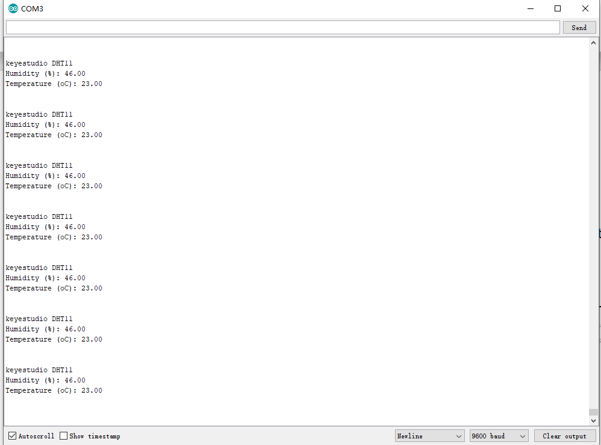

**5.Temperature Humidity Meters Circuit Connection**

Now we start to use LCD screen to print the value of DHT11 sensor, we will see
the value on the LCD screen. so let’s start the project. Connect according to
the connection diagram below.

**6.Project Code**

<iframe src=https://create.arduino.cc/editor/keyestudio/03274894-422d-4ff6-992f-d13fec57a7ec/preview?embed style="height:510px;width:100%;margin:10px 0" frameborder=0></iframe>

**7.Project Result**

Upload the code to Mega plus development board. 1602 display shows the current
temperature and humidity. We can use it as a real-time environmental monitoring
tool.

\*\*\*\*\*\*\*\*\*\*\*\*\*\*\*\*\*\*\*\*\*\*\*\*\*\*\*\*\*next
project\*\*\*\*\*\*\*\*\*\*\*\*\*\*\*\*\*\*\*\*\*\*\*\*\*\*\*\*\*\*\*\*\*\*\*\*\*

### Project 28: Smart House

**1.Project Introduction**

IR remote is a low-cost and easy to use wireless communication technology. IR
light is very similar to visible light, except that it has a slightly longer
wavelength. This means IR is undetectable to the human eye - perfect for
wireless communication. For example, when you hit a button on your TV remote, an
IR LED repeatedly turns on and off, 38,000 time a second, to transmit
information (like volume or channel control) to an IR photo sensor on your TV.

We will first explain how common IR communication protocols work. Then we will
start this project with a remote control and an infrared receiving component.

We prepare a house cartoon board. When we press the button of the remote
control, the light on the house will be on, press the button again, it will be
off.

**2.Project Hardware**

| **** |    |   |   |
|--------------------------------------------------------------|---------------------------------------------------|--------------------------------------------------|--------------------------------------------------|
| Mega Plus Development Board\*1                               | Plus Board Holder                                 | 400-Hole Breadboard                              | USB Cable\*1                                     |
|             |    |   |   |
| Infrared Remote Controller \*1                               | Red M5 LED \*3                                    | 220Ω Resistor\*3                                 | Infrared Receiver Module\*1                      |
|               |    |                                                  |                                                  |
| Small House Paper Card\*1                                    |  Jump Wire \*10+                                  |                                                  |                                                  |

1.  **How does infrared remote works**

**What is infrared?**

Infrared radiation is a form of light similar to the light we see all around us.
The only difference between IR light and visible light is the frequency and
wavelength. Infrared radiation lies outside the range of visible light, so
humans can’t see it:

Because IR is a type of light, IR communication requires a direct line of sight
from the receiver to the transmitter. It can’t transmit through walls or other
materials like WiFi or Bluetooth.

**How IR and receiver work**

A typical infrared communication system requires an IR transmitter and an IR
receiver. The transmitter looks just like a standard LED, except it produces
light in the IR spectrum instead of the visible spectrum. If you have a look at
TV remote, you’ll see the IR transmitter
LED:

The IR receiver is a photodiode and pre-amplifier that converts the IR light
into an electrical signal. IR receiver diodes typically look like this:

**Ir signal modulation**

IR light is emitted by the sun, light bulbs, and anything else that produces
heat. That means there is a lot of IR light noise all around us. To prevent this
noise from interfering with the IR signal, a signal modulation technique is
used.

In IR signal modulation, an encoder on the IR remote converts a binary signal
into a modulated electrical signal. This electrical signal is sent to the
transmitting LED. The transmitting LED converts the modulated electrical signal
into a modulated IR light signal. The IR receiver then demodulates the IR light
signal and converts it back to binary before passing on the information to a
microcontroller:

The modulated IR signal is a series of IR light pulses switched on and off at a
high frequency known as the carrier frequency. The carrier frequency used by
most transmitters is 38 kHz, because it is rare in nature and thus can be
distinguished from ambient noise. This way the IR receiver will know that the 38
kHz signal was sent from the transmitter and not picked up from the surrounding
environment.

The receiver diode detects all frequencies of IR light, but it has a band-pass
filter and only lets through IR at 38 kHz. It then amplifies the modulated
signal with a pre-amplifier and converts it to a binary signal before sending it
to a microcontroller.

**IR Codes**

Each time you press a button on the remote control, a unique hexadecimal code is
generated. This is the information that is modulated and sent over IR to the
receiver. In order to decipher which key is pressed, the receiving
microcontroller needs to know which code corresponds to each key on the remote.

Different remotes send different codes for the keypresses, so you’ll need to
determine the code generated for each key on your particular remote. If you can
find the datasheet, the IR key codes should be listed. If not though, there is a
simple Arduino sketch that will read most of the popular remote controls and
print the hexadecimal codes to the serial monitor when you press a key. I’ll
show you how to set up in a minute, but first we need to connect the receiver to
the Arduino…

**4.Decode the IR Signals**

We connect the infrared receiver module to the Mega plus development board
according to the wiring diagram below.

**Install the irremote library**

We’ll use the IRremote library for all of the code examples below. You can
download a ZIP file of the library :
[https//github.com/shirriff/Arduino-IRremote](https://github.com/shirriff/Arduino-IRremote).

To install the library from the ZIP file, open up the Arduino IDE, then go to
Sketch \> Include Library \> Add .ZIP Library, then select the IRremote ZIP file
that you downloaded from the link above.

**Find the codes for you remote**

<iframe src=https://create.arduino.cc/editor/keyestudio/83ac979b-cb5f-4a39-8ef3-cb0e192ec253/preview?embed style="height:510px;width:100%;margin:10px 0" frameborder=0></iframe>

upload this code to Mega plus board and open the serial monitor at a baud rate
of 9600.

You will see a code on the serial monitor. Press the same button several times
to make sure you have the right code for that button. If you see FFFFFFFF, just
ignore it.

Write down the code associated with each button, because you’ll need that
information later.

**5. Smart House Circuit Connection**

Now I’ll show you how to control the Arduino’s output pins using IR remote. In
this project, we will light up an LED. You can easily modify the code to do
things like control servo motors, or activate relays with any button press from
the remote.

Connect the LEDs with resistors to pin 8, 9, 10.

**6.Project Code**

<iframe src=https://create.arduino.cc/editor/keyestudio/0adff088-aaa4-48e8-95e5-88d99552ca86/preview?embed style="height:510px;width:100%;margin:10px 0" frameborder=0></iframe>

**Note :** add IRremote folder into installation directory Arduino compiler
libraries, or you will fail to compile it.

Infrared remote library
[https//github.com/shirriff/Arduino-IRremote](https://github.com/shirriff/Arduino-IRremote)

**7.Project Result**

Upload the code to the development board. Hook up components as follows. Press
button 1 and 4 to turn on and off the first LED. Press button 2 and 5 to control
the second LED. And press button 3 and 6 to control the state of the third LED.

